# Policy-Aware AI API Explorer

<div align="center">
  <h3>🛡️ AI-Driven Security & Dynamic UI Generation 🛡️</h3>
  <p>An intelligent API API Explorer that uses LLMs to analyze request safety in real-time and dynamically enforces UI restrictions.</p>
</div>

---

## 💡 The Problem
In modern AI applications, users often interact with APIs that can perform sensitive or dangerous operations. Traditional hard-coded RBAC (Role-Based Access Control) is rigid and often fails to capture the nuanced *intent* of a user's request.

## 🚀 The Solution
The **Policy-Aware AI API Explorer** introduces a **Safety Layer** that sits between the user and the API. It uses:
1.  **AI Analysis**: To understand the semantic intent and risk of a request.
2.  **Dynamic Policies**: To generate a strict "UI Contract" on the fly.
3.  **Generative UI**: To render an interface that physically prevents unsafe actions (e.g., locking buttons, hiding sensitive fields) based on that contract.

## 🧠 Architecture

```mermaid
sequenceDiagram
    participant User
    participant Frontend as Next.js Frontend
    participant Backend as FastAPI Backend
    participant LLM as Gemini/OpenAI
    participant Database as Supabase

    User->>Frontend: Selects API & Enters Intent
    Frontend->>Backend: POST /analyze-api
    Backend->>LLM: Analyze Risk (Threat, Sensitive, Urgency)
    LLM-->>Backend: Safety Verdict
    Backend->>Database: Log Verdict (Audit)
    Backend->>Backend: Generate UI Plan (Rule Engine)
    Backend-->>Frontend: Return UI Plan + Verdict
    
    rect rgb(20, 20, 20)
        Note over Frontend: Dynamic Rendering
        Frontend->>Frontend: Apply Restrictions (Lock Buttons, Show Warnings)
        Frontend-->>User: Display Safe UI
    end
```



## ✨ Key Features

- **🛡️ Real-Time Safety Analysis**: Instantly detects:
  - **Threats**: Destructive actions (SQLi, deletions).
  - **Sensitive Data**: PII, financial data, auth tokens.
  - **Urgency**: Social engineering patterns.
- **🎨 Dynamic UI Generation**: The frontend is "dumb" - it strictly follows the backend's UI Plan to:
  - **Disable Execution**: Prevent "Send Request" for threats.
  - **Hide Fields**: Redact sensitive parameter inputs.
  - **Show Warnings**: Display contextual safety alerts.
- **🔒 Supabase Integration**:
  - Secure Authentication.
  - **Row Level Security (RLS)** for user profiles/data.
  - **Audit Logging** of all safety checks.

## 🛠️ Tech Stack

| Component | Technology | Role |
|-----------|------------|------|
| **Frontend** | Next.js 14, TailwindCSS, Framer Motion | Dynamic UI Rendering |
| **Backend** | FastAPI, Python 3.10+ | Safety Logic & API Orchestration |
| **Database** | Supabase (PostgreSQL) | Auth, Profiles, Logs |
| **AI Model** | Google Gemini 1.5 / GPT-4o | Risk Analysis Engine |

## ⚡ Quick Start

### 1. Backend Setup
```bash
cd backend
pip install -r requirements.txt
# Setup .env (see backend/README.md)
uvicorn main:app --reload
```

### 2. Frontend Setup
```bash
cd frontend
npm install
# Setup .env.local (see frontend/README.md)
npm run dev
```

### 3. Explore
Open [http://localhost:3000](http://localhost:3000) and try the demo endpoints:
- **Safe**: `/api/weather` (Full UI access)
- **Sensitive**: `/api/payments` (Restricted mode)
- **Dangerous**: `/admin/users` (Blocked execution)

## 📄 License
MIT License. Built for TamboAI Hackathon 2026.
